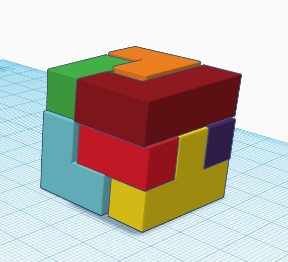
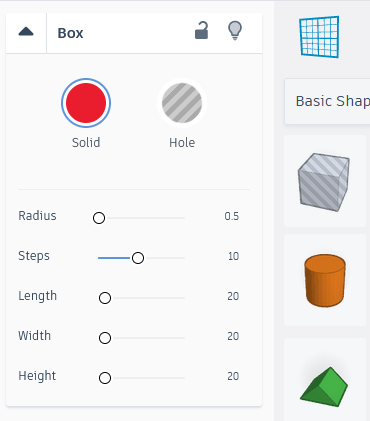
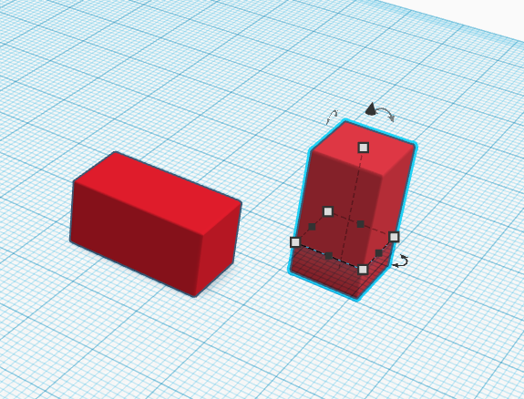
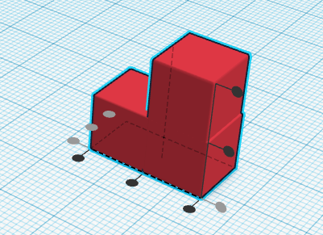
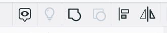
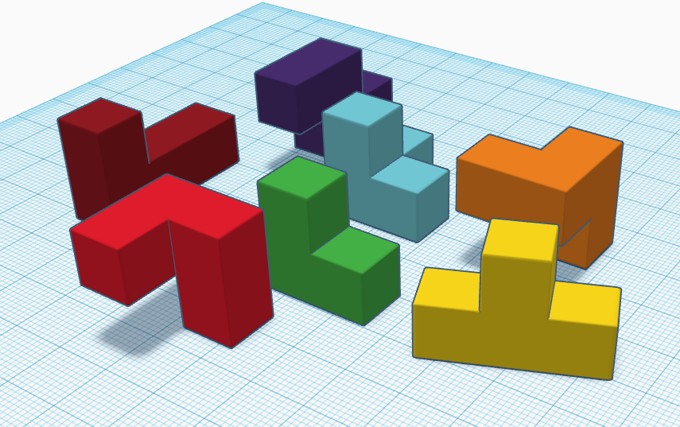

 
# Puzzle Cubes Activity 
If you and your group have any questions or get stuck as you work through this in-class exercise, please ask the instructor for assistance.  Have fun!

(NOTE: If you are attending in person, we are recreating the blocks from puzzle cubes with 3D printed examples available on the tables. The red printed cube puzzle is the Soma puzzle, the white one is the Hoffmann puzzle, the Yellow one is the Coffin puzzle, and the blue one is the Nob puzzle. You can find ideas for classroom activities for this [by clicking on this link and reading through the Thing Details summary section](https://www.thingiverse.com/thing:1565383){:target="_blank"}. If you are attending online, we are recreating the puzzle cubes from that link above, and you can download one of the STL files and import it into Tinkercad and recreate the blocks using the STL as a guide. Let us know if you need assistance for this.)
1. If you haven’t already, please go to [the TinkerCad website and create an account](http://tinkercad.com){:target="_blank"} for yourself. If you find yourself in a tutorial, click on the Tinkercad logo in the top left of the screen to exit to the home page.
2. Click **Create new design**. If the TinkerCad tutorial pane is up on the right-hand side, you will need to get out of it before proceeding. Click on the TinkerCad logo at the top to bring you back to your main page. From there you should see the “Create new design” button. 
3. On the right side of the TinkerCad open a drop-down menu by clicking on **Basic Shapes**, and then select the **Basic Shapes** option if this is not already showing. This will display a list of 3D shapes that you can scroll down through. We will just be using the basic square block (in red) for this activity.
4. Drag and drop a single block onto the workplane. 
    
5. We need to resize the blocks to a smaller size to make them easier to work with. To start doing this click on the block, and then (A) click on the **white dot** on one of the corners of the block (which will then turn red). (B) click on the **20.00** and change the number to “10” and then press the enter key, and the block will change size. Do the same to the top white dot to change the height of the block to **10.00**. 
6.  With the block selected, in the **Box** settings menu, change the **Radius** to **0.5**.  
7. Now we need to copy and rotate the rectagle blocks. Click on the block to make sure it is selected. You can use **Ctrl + C** and **Ctrl + V** on Windows or **Command + C** and **Command + V** on Apple (key combination on your keyboard) to copy and paste the block. To rotate the block, use the rounded handle that is hovering above the block. 

    

8.  Move the blocks together to form the shape you want. If you want to make sure it is properly aligned, select both blocks and then click on the **Align** button at the top (shaped like a graph). This will bring up little round, black handles along the edges of the blocks that can be used to align them at the points needed. Once you have the alignment desired, you can click on the **Group** button (looks like a square and circle blended together)   to make them into a single shape. 

9. Repeat steps 1-8 to create shapes to match the Puzzle. 

     

10.  You can test the puzzle in Tinkercad by moving the shapes around to fit them together to make a cube. 
11. For more Educational ideas check out the following links or search "educational" on [Thingiverse](https://www.thingiverse.com){:target="_blank"}:
 - [Hovering Disk](https://www.thingiverse.com/thing:1936208){:target="_blank"}
 - [3D-Mapped Storm Images](https://www.thingiverse.com/thing:1174508){:target="_blank"}
 - [Clay Tool Design Challenge](https://www.thingiverse.com/thing:1294945){:target="_blank"}
 
[NEXT STEP: Design Tips](11-design-tips.html){: .btn .btn-blue }
