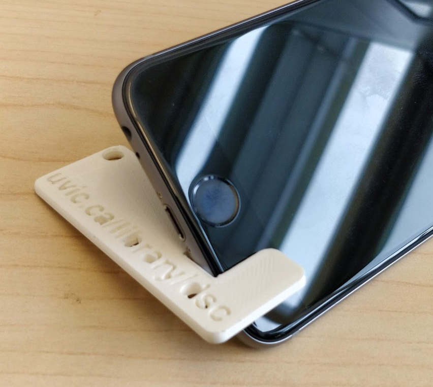
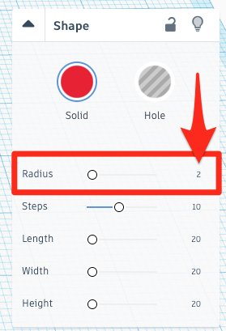
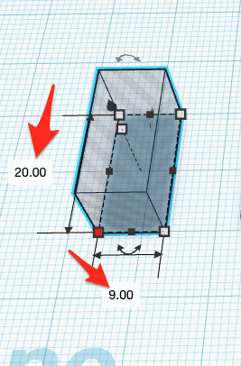
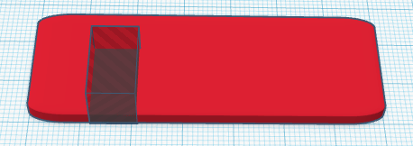
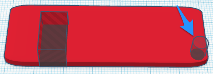
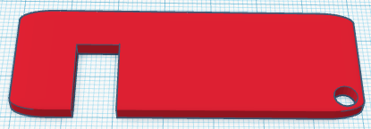
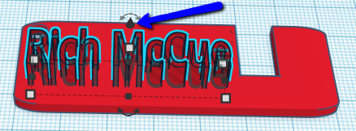
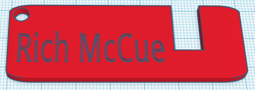

# Cellphone Keychain Activity 

If you and your group have any questions or get stuck as you work through this in-class exercise, please ask the instructor for assistance.  

1. If you haven’t already, please go to the [TinkerCad website and create an account](http://tinkercad.com){:target="_blank"} for yourself  If you find yourself in a tutorial, click on the Tinkercad logo in the top left of the screen to exit to the home page.

    

2. Create the basic shape of the Cell phone stand:
 - Click “**Create new design**”.
    - On the right side of the TinkerCad open a drop-down menu by clicking on **Basic Shapes**, and then select the red **Box** shape, and then drag and drop it on the build plate. 
    - Select the white handle at the top of the shape and drag it down to the height of “**3.00**”.
    - Select one of the **white handles** at the base of the box, and set the base to “**70.00**” by “**25.00**”.
    - Make sure that your box is selected and then in the **Shape** menu to the right of the screen change the **Radius** to “**2**” (see diagram to the right for details).

    <button onclick="toggle('gif1')">Show/Hide Animation</button>
    

    
    

    

3. Measure the width of your phone:
 - Use a calliper tool so that you can measure the width of your cell phone. NOTE: If a calliper tool is not available, you can use a ruler to measure your phone thickness with the case on, and choose the closest one of the following most common sizes: 9mm, 11mm, 13mm, 15mm
    - Write down the width of your cell phone, out to two decimal places.
    - Now add 0.5mm to the width of your phone and write it down (E.g. if my phone was 8.50mm then I’d write 9.00mm)

    

4. Create the notch and hole for your keychain:
 - On the right side of the screen select the grey striped **Box** shape, and then **drag and drop** it on the build plate. 
    - Select the white handle at the top of the shape and drag it down to the height of “**10.00**”.
    - Click on one of the **white handles** at the base of the box, and type in “**16.00**” and **the width of your cell phone plus 0.5mm**. _NOTE:  Please ask the instructor for help if you are unsure about this because this is very important to the success of your project._
    - Move the grey box so that it is flush with the edge of the red box, and 12mm away from the left side of the box. You can count the square boxes in order to measure the 12mm (as you can see to the right) or you can use the ruler function. Ask your instructor for assistance if you are unsure.

        <button onclick="toggle('gif2')">Show/Hide Animation</button>
        

        
        

        

 - On the right side of the screen select the grey striped Cylinder shape, and then **drag and drop** it on the build plate.   
    - Select the **white handle** at the top of the shape and drag it down to the height of “**10.00**”.
    - Click on one of the **white handles** at the base of the box, and type in “**5.00**” and “**5.00**”. 
    - Move this **grey cylinder** to the bottom right of the red box (as you can see to the right).
    
    - **Select all of the objects** on your build plate and then click on the **Group** button on the top menu.
    - Your cell phone holder should look like this:

    <button onclick="toggle('gif3')">Show/Hide Animation</button>
    

    
    

**OPTIONAL**: You can customize your cell phone holder by embossing your name or something else on the top of it:
 - On the right side of the screen select the red **Text** shape, and then **drag and drop** it on the build plate. 
 - In the **Shape** menu on the right, type something into the **Text** field. 
 - If you want you can change the **Font** in drop down box below the Text field.
 - While still, in the **Shape** menu, click on the grey striped **Hole** icon.

    

 - Select one of the **white handles** at the corner of the text box, and drag it until the text is small enough to fit on the top of the cell phone holder. 
 - **Drag** the text on to the top of the phone holder.

    

 - With the text object selected grab the black cone on top of the object (see image to the right), and drag it upward **2mm**.
 - **Select** both the text box and phone holder and then press the **Group** button on the top menu.

    <button onclick="toggle('gif4')">Show/Hide Animation</button>
    

    
    

- Lastly, click on the **Export** button on the top right of the toolbar, and then select **.STL** and save the file to your hard drive so you can 3D print your cellphone stand!

[NEXT STEP: Game piece activity](3-game-activity.html){: .btn .btn-blue }
