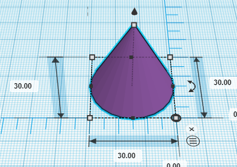
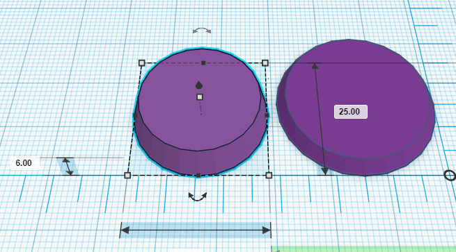
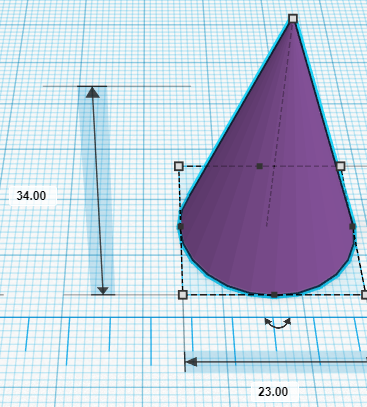
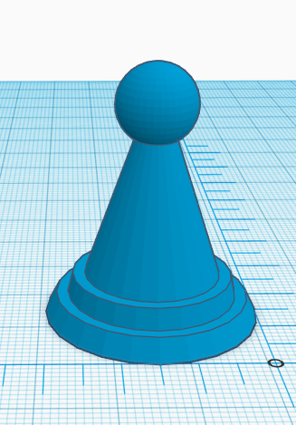

# Game Piece Activity

1. Open up [TinkerCad](https://www.tinkercad.com/){:target="_blank"}, create an account or log-in. Open a new design. 
2. Make the base of the piece:
  - Grab a cone from the basic shapes panel on the right and drag it on to the workplane. 
  - Stretch the cone so that it is 30mm for all three dimensions by dragging the white handles on the base and top of the cone (or by clicking on the handles and entering “**30**” in the fields).

  <button onclick="toggle('gif1')">Show/Hide Animation</button>

    
    

3.  Drag and drop a cylinder “**hole**” from the basic shapes panel on the right.
  - Change the size of the cylinder to 30mm for all three dimensions, by clicking on the cylinder & selecting the white corner handles. 
  - Raise this cylinder 3mm from the workplane by dragging the small black “cone” on the top of the cylinder upwards.

  <button onclick="toggle('gif2')">Show/Hide Animation</button>

    
    

4. Group the cone and cylinder hole together
  - Select both the cone and cylinder. 
  - Select the align tool from the top menu and click on the two black centre handles on Workplane.
  - Click on the “**Group**” button on the top menu or **Ctrl + G**. This will group the cone and cylinder together to make an angled disc.

  <button onclick="toggle('gif3')">Show/Hide Animation</button>

    
    

5. Duplicate the disc:
  - Select the disk and then duplicate by pressing: **Ctrl + D**
  - Move the disk to reveal the duplicate underneath.
  - Stretch the duplicate to 25mm across the bottom dimensions. 
  - Stretch the height to 6mm by selecting the white handle on the top of the 25mm disk. 
  - “**Align**” both disks and group. 

  <button onclick="toggle('gif4')">Show/Hide Animation</button>

    
    

6. Drag a new cone onto the workplane:
  - Stretch it to 23mm for both bottom dimensions.
  - Stretch to 34mm tall
  - Align all objects and “**group**”. 

  <button onclick="toggle('gif5')">Show/Hide Animation</button>

    
    

7. Add something fun to the top of your game piece:
  - Drag a sphere (or another interesting shape) to the workplane:
  - Shrink the shape down so the base and height measurements are all 11mm. 
  - Raise the sphere 25mm from the workplane, by grabbing the black hat on top of the cone upwards.
  - “**Align**” all shapes on workplane & then “**Group**” all pieces together.

  <button onclick="toggle('gif6')">Show/Hide Animation</button>

    
    

8. Lastly, click on the “**Export**” button on the top right of the toolbar, and then select “**.STL**” and save the file to your hard drive so it’s ready for the next stage of the 3D printing process.

[NEXT STEP: Dice Activity](4-dice-activity.html){: .btn .btn-blue }
