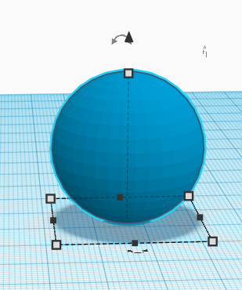
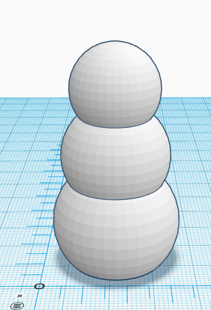
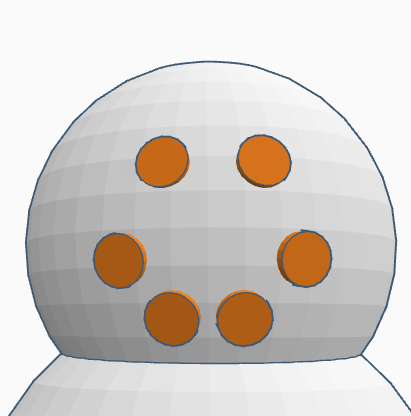
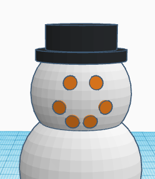

# Snowperson Ornament Activity
1. If you haven’t already, please go to the [TinkerCad website](http://tinkercad.com){:target="_blank"} and create an account for yourself. If you find yourself in a tutorial, click on the Tinkercad logo in the top left of the screen to exit to the home page.

2. Click **Create new design**. If the TinkerCad tutorial pane is up on the right-hand side, you will need to get out of it before proceeding. Click on the TinkerCad logo at the top to bring you back to your main page. From there you should see the **Create new design** button. 

3. On the right side of the TinkerCad open a drop down menu by clicking on **Basic Shapes**, grab a sphere and drag it onto the workplane
- Select the shape, and a grid should pop up around the shape. Using the **white corner handles**, stretch the sphere so that it is **30mm** for all three dimensions. 
 <button onclick="toggle('gif1')">Show/Hide Animation</button>
    

    
    

4. From **Basic Shapes**, grab a hollow box
- Change the size of the hollow box to **30mm wide**, **30mm long**, and **4mm tall**
- With the shape selected, press D to drop it flat on the workplane. 

5. Select both the ball and the hollow box.
- Now select the **Align** tool from the top menu. **Two black centre handles** should appear. Double click on them
- Click on the **Group** button on the top menu. This will group the box and sphere together. Then, press **D** to drop the flat bottomed sphere.
<button onclick="toggle('gif2')">Show/Hide Animation</button>
    

    
    

6. From **Basic Shapes**, add a second sphere:
- Stretch it to **25mm** across all dimensions. 
- Using the black triangle on top, lift it from work plane **14mm** 
- **Align** the sphere on the larger sphere, and **Group**.  
<button onclick="toggle('gif3')">Show/Hide Animation</button>
    

    
    

7.  From **Basic Shapes**, make a third sphere:
- Stretch it to **20mm** for all dimensions.
- Using the black triangle, lift from work plane **32mm** 
- **Align** all objects and **Group**. 

8. From **Basic Shapes**, add a cylinder to the workplane
- Using the **white corner handles**, set all dimensions at **2.5mm**
- Select the object. A **circular, black two-ended arrow** should pop up. Select that to rotate the shape **-90 degrees**. 
<button onclick="toggle('gif4')">Show/Hide Animation</button>
    

    
    

9.  Using **copy and paste**, duplicate this shape 5 times 
- Select the **black triangle** on top of each cylinder to raise it to the height of the spheres. Attach them on to make a face (or buttons!)
- You can shrink and rotate here to make your smiley face look nice however you like

10. Now, your snowperson needs a hat! 
    
- From **Basic Shapes**, select a **cylinder**. Make it **18mm** long by **18mm** wide, and **2mm** tall. 
- Make a second **cylinder** that is **14mm** long by **14mm** wide, and **7mm** tall. 
- **Align** the two cylinders, and **group** them. 
- Raise your hat **52mm** from the workplane, and align it to your snowperson. You can tilt it a little, or leave it flat. 
<button onclick="toggle('gif5')">Show/Hide Animation</button>
    

    
    

11. Add a **cylinder** onto the workplane
- Make it **7mm** long by **7mm** wide and **4mm** tall. 
- Next, select a hollow **cylinder**. Make it **5mm** long, **5mm** wide and **4mm** tall
- Set the hollow cylinder inside of the larger one. **Align** both shapes, and then **Group** them
- Rotate the new tube **90 degrees** so it is standing on its round edge, and **align** to the top of the snowperson
- Raise the ring **56mm**, and center it on the snowperson. 
<button onclick="toggle('gif6')">Show/Hide Animation</button>
    

    
    

12. Congratulations on your hanging snowperson ornament!

13. Lastly, click on the “**Export**” button on the top right of the toolbar, and then select “**.STL**” and save the file to your hard drive so you can 3D print your snowperson!

[NEXT STEP: Snowflake Ornament Activity](7-snowflake-activity.html){: .btn .btn-blue }
