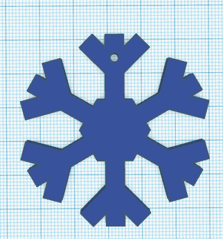
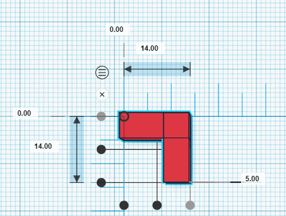
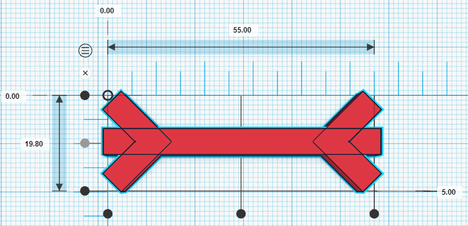
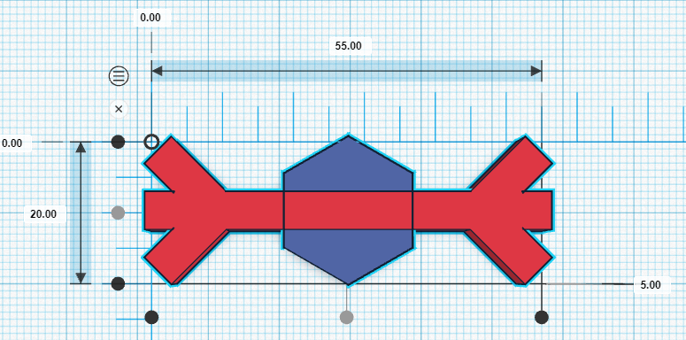
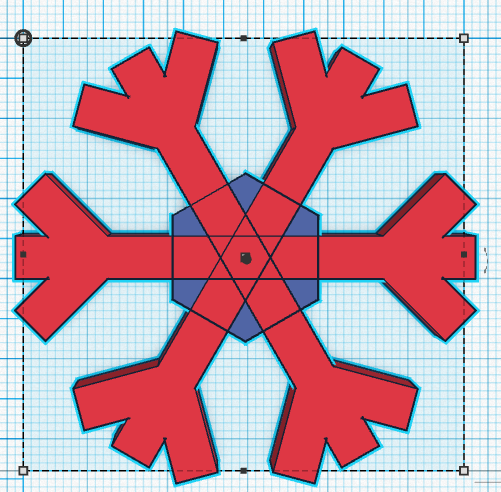
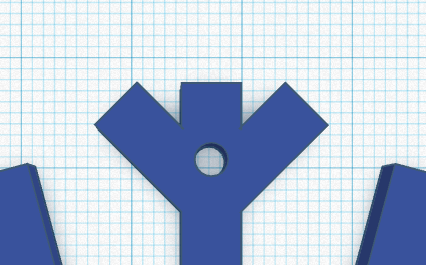

# Snowflake Ornament Activity
1. Open up [TinkerCad](https://www.tinkercad.com/){:target="_blank"}, make an account or log-in. Open a new design. On the top left, change the name to Snowflake.

2. From the **Basic Shapes**, grab a box and place it on the workplane. 
- **Select** the **white handles** and change it to a rectangle that is **5mm** tall by **5mm** wide and **55mm** long. 
    

    <button onclick="toggle('gif1')">Show/Hide Animation</button>
    

    
    

3. From the **Basic Shapes**, **select** a second box and place it on the workplane. 
- Make it **5mm** tall by **5mm** wide and **14mm** long. 
- **Duplicate** it. Using the **curved black arrow**, **rotate** the new shape **90 degrees**.
- **Align** the two shapes together like an ‘L’. 
- Click the **Group** button. 
- **Duplicate** the corner. 

    <button onclick="toggle('gif2')">Show/Hide Animation</button>
    

    
    

4. **Rotate** the corner you just created 45 degrees, and **Align** it to one side of your rectangle to create a “leaf” (see to the right). 
- **Rotate** the other corner **180** degrees and align to the other end of the rectangle. 
- **Group** these three items.
- Make **two** more copies of this shape. 
    

    <button onclick="toggle('gif3')">Show/Hide Animation</button>
    

    
    

5. In the **Basic Shapes** menu, **select a polygon** and place it onto the Workplane. 
- Leave it with 6 sides, as a hexagon
- **Decrease** the height to **5mm**. 
- **Align** it to the center of the leaf. 
    

    <button onclick="toggle('gif4')">Show/Hide Animation</button>
    

    
    

    

6. Using one of your other leaves, **rotate** it **60 degrees**. **Align** it onto the hexagon (see image).
- With the third leaf, **rotate** it **-60 degrees**. **Align** it onto the hexagon, then **Group** everything.

    

    <button onclick="toggle('gif5')">Show/Hide Animation</button>
    

    
    

7. From “Basic Shapes”, select and place a **hollow cylinder** on the Workplane. 
 - Shrink it to **3mm** by **3mm** and **6mm** tall. 
 - Place it in the center of one leaf, near the edge (see right). 
 - Make sure it is firmly on your workplane by pressing **D**. Next, select **Align**
 - This is your hole for your string.

    <button onclick="toggle('gif6')">Show/Hide Animation</button>
    

    
    

    

8. Congratulations, you have a snowflake you are ready to print! You can make it more complex if you want, just remember that it has to be kind of small.

9. Lastly, click on the “**Export**” button on the top right of the toolbar, and then select “**.STL**” and save the file to your hard drive so you can 3D print your snowflake!

[NEXT STEP: Importing and Modifying STL in TinkerCad](8-importing-modifying-stl.html){: .btn .btn-blue }
