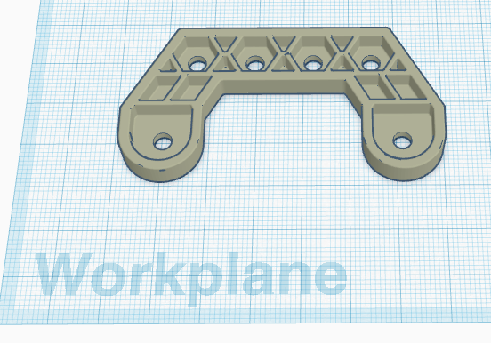
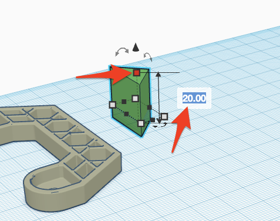
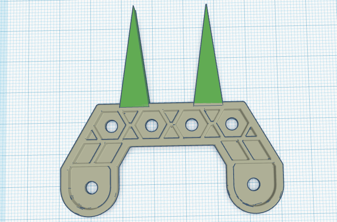
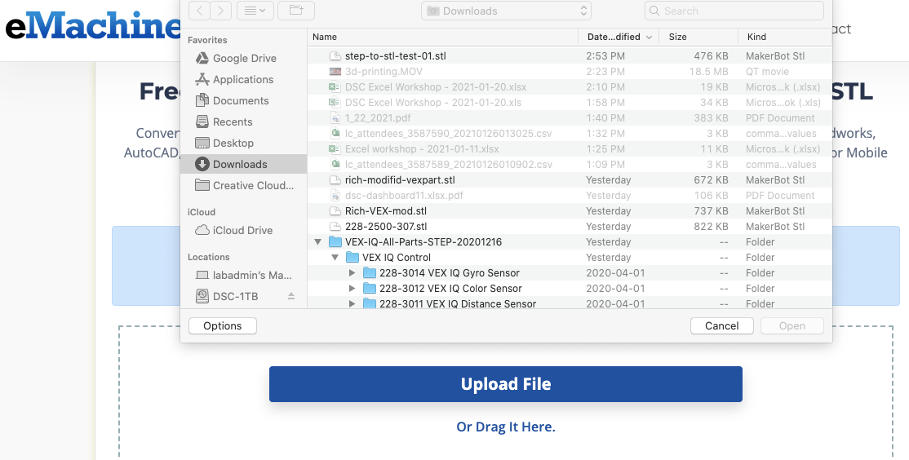

# Importing and Modifying STL in TinkerCad

If you and your group have any questions or get stuck as you work through this in-class exercise, please ask the instructor for assistance.  Have fun! 
NOTE: no responsibility for the accuracy of the VEX 3d parts for 3rd party website.

1. If you haven’t already, please go to the [TinkerCad website](http://tinkercad.com){:target="_blank"} and create an account for yourself.  If you find yourself in a tutorial, click on the Tinkercad logo in the top left of the screen to exit to the home page.

2. Click **Create new design**. If the TinkerCad tutorial pane is up on the right-hand side, you will need to get out of it before proceeding. Click on the TinkerCad logo at the top to bring you back to your main page. From there you should see the “Create new design” button. 
    

3. Download and import an STL model file into TinkerCad in preparation for modifying it. For example, let’s customize a part for a VEX Robotics kit:
- Download the [276-6010-007 Mount.STL](https://www.idesignsol.com/files/276-6010-007%20Mount.STL){:target="_blank"} file to your computer. 
Note: If you’d like to modify other VEX parts, you can directly download a [small number of parts from iDesign Solutions](https://www.idesignsol.com/index.php?route=blog/article&article_id=23){:target="_blank"} (see step 6 for many, many more parts you can modify with a bit more work).
    
- In TinkerCad click on the grey **Import** button on the top right of the screen, and then find and select the STL file you just downloaded. Click on the **Import** button.

    <button onclick="toggle('gif1')">Show/Hide Animation</button>
    

    
    

4. Modify and customize the model you just imported into TinkerCad. You can use any of the tools you learned to use in the other TinderCad activities to customize this model.

    <button onclick="toggle('gif2')">Show/Hide Animation</button>
    

    
    

- Click on the **Roof** Tool and then click on the Workplane where you would like to put it.
- **Rotate** the roof 90 degrees so that it is standing on end by dragging the curved arrow at the top of the roof (see image on right).
- Click on the **white handle** at the top of the Roof and then change the height from 20.00mm to 6.35mm (see image on right).
- You can now stretch and move the triangle to the shape you would like for your modified part. Below is an example of a modified part where the part was stretched and then copied before moving the additional elements of the model into position (see below): 

    <button onclick="toggle('gif3')">Show/Hide Animation</button>
    

    
    

    

5. When you are finished modifying the model, click on the **Export** button on the top right of the toolbar, and then select **.STL** and save the file to your hard drive so it’s ready for the next stage of the 3D printing process.

Good Job!

**OPTIONAL: If you would like to modify one of hundreds of VEX parts continue with this optional activity:**

6. Download a ZIP file with all [VEX IQ CAD parts in STEP format](https://link.vex.com/cad/STEP/VEX-IQ-All-Parts-STEP){:target="_blank"} (Zip, 96.27 MB) and Unzip the file.

7. Convert one of the models into STL format:
- Open the [eMachine Shop](https://convert.emachineshop.com/){:target="_blank"} website, and then click on the blue Upload File button.
- Select one of the STEP model files you just downloaded and unzipped on your computer.
    
- Select the “Convert Uploaded File to type” to **STL**.
- Click on the green **Convert File** button. Once the website has finished converting the STEP file to STL format you can download the file, and then import the STL file into TinkerCad (see Step 3 above).

8. If you’d like to design your VEX compatible parts based on the VEX 2600 structure pieces, you can use the [measurements on this PDF](https://content.vexrobotics.com/docs/276-2600-Structure-Pieces.pdf){:target="_blank"} for reference purposes. Note that the measurements on the PDF are in inches and TinkerCad uses mm, as does the 3D printing software in the DSC. 

[NEXT STEP: Importing and Modifying 2D images](9-Importing-2D.html){: .btn .btn-blue }
