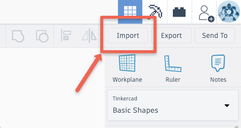
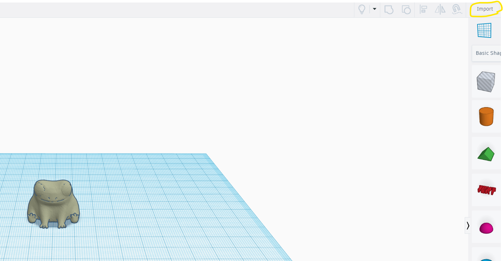
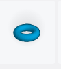
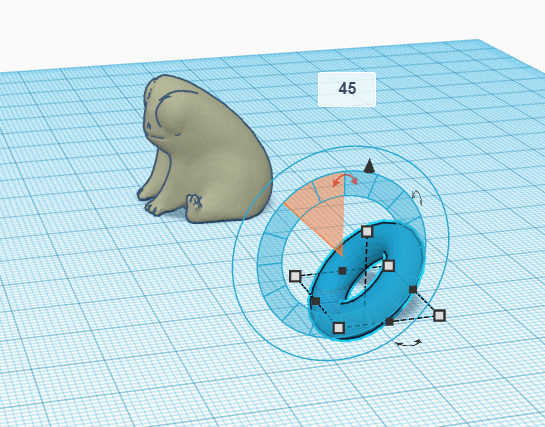
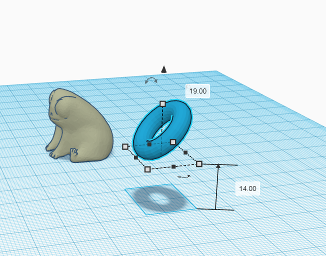
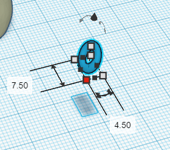
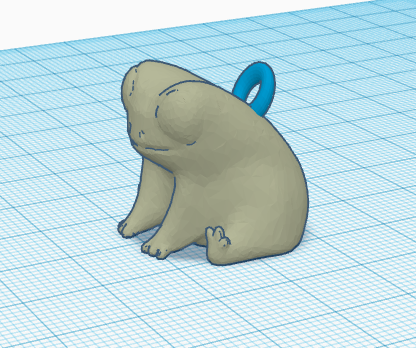

# Importing and Modifying STL in TinkerCad

If you and your group have any questions or get stuck as you work through this in-class exercise, please ask the instructor for assistance.  Have fun! 
NOTE: no responsibility for the accuracy of the VEX 3d parts for 3rd party website.

1. If you haven’t already, please go to the [TinkerCad website](http://tinkercad.com){:target="_blank"} and create an account for yourself.  If you find yourself in a tutorial, click on the Tinkercad logo in the top left of the screen to exit to the home page.

2. Click **Create new design**. If the TinkerCad tutorial pane is up on the right-hand side, you will need to get out of it before proceeding. Click on the TinkerCad logo at the top to bring you back to your main page. From there you should see the “Create new design” button. 
    

3. Download and import an STL model file into TinkerCad in preparation for modifying it.
- Download the (first file only) [frog.stl](https://www.thingiverse.com/thing:4838220/files){:target="_blank"} file to your computer. 
- In TinkerCad click on the grey **Import** button on the top right of the screen, and then find and select the STL file you just downloaded. Click on the **Import** button.(see image)

4. Modify and customize the model you just imported into TinkerCad. You can use any of the tools you learned to use in the other TinderCad activities to customize this model. 

 - Click on the **Torus** Tool and then click on the Workplane where you would like to put it.
 - **Rotate** the torus 45 degrees so that it is standing on end by dragging the curved arrow at the top of the torus (see image on right). 
 
 - Click on the **Black triangle** above the torus and enter 14mm. (see image on right).
 
 -  Click on the **white handle** at the top of the Torus and then change the height from 15.61mm to 7.5mm.
 -  Click on any of the four white squares around the torus and change the dimensions to length: 7.5mm and width 4.5mm. (see image with dimensions)
 -   
- Next move the torus to the back of the frog (see image).
-  

5. Group all pieces of your model together by dragging across to select all (see image on right).

7. When you are finished modifying the model, click on the **Export** button on the top right of the toolbar, and then select **.STL** and save the file to your hard drive so it’s ready for the next stage of the 3D printing process.

    Good Job!

[NEXT STEP: Importing and Modifying 2D images](9-Importing-2D.html){: .btn .btn-blue }
