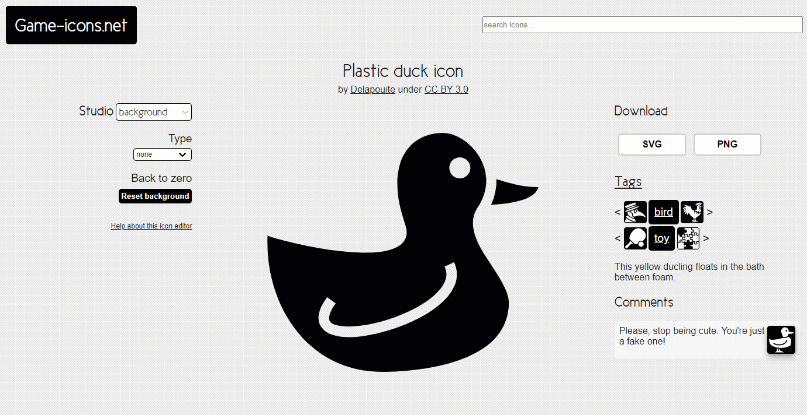

# Importing and Modifying 2D images

If you and your group have any questions or get stuck as you work through this in-class exercise, please ask the instructor for assistance.  Have fun! 
NOTE: no responsibility for the accuracy of the VEX 3d parts for 3rd party website.

1. If you haven’t already, please go to the [TinkerCad website](http://tinkercad.com){:target="_blank"} and create an account for yourself.  If you find yourself in a tutorial, click on the Tinkercad logo in the top left of the screen to exit to the home page.

2. Click **Create new design**. If the TinkerCad tutorial pane is up on the right-hand side, you will need to get out of it before proceeding. Click on the TinkerCad logo at the top to bring you back to your main page. From there you should see the “Create new design” button. 

3. Download and import an STL model file into TinkerCad. 
- Click [this link to find a downloadable duck.](https://game-icons.net/1x1/delapouite/plastic-duck.html){:target="_blank"} Click the **SVG** button on the right side of the webpage to download the svg file. 
    -  _Note: TinkerCAD will not import .png or other types of image file, so make sure you download the correct file type!_ 
    -   You can also use a program like Inkscape to [convert an image to svg](https://docs.google.com/document/d/1HN7EW7bgU1e_EtFqS2a65FwQNgY3sPT73x4TOv8An0E/edit)
- In TinkerCad click on the grey **Import** button on the top right of the screen, and then find and select the SVG file you just downloaded. Set the **scale** to **20%**, then click on the **Import** button.

 <button onclick="toggle('gif1')">Show/Hide Animation</button>
    

    
    

4. Join the beak and the duck body. 
-   Add a cylinder to the workplane and adjust the height to 10.  
-   Use the arrows to fit the cylinder between the beak and the duck body. 
-   Group the cylinder and duck together. 

 <button onclick="toggle('gif2')">Show/Hide Animation</button>
    

    
    

5. When you are finished modifying the model, click on the **Export** button on the top right of the toolbar, select **.STL** and save the file to your hard drive so it’s ready for the next stage of the 3D printing process.
Good Job!

[NEXT STEP: Cube Puzzle](10-cube-puzzle.html){: .btn .btn-blue }