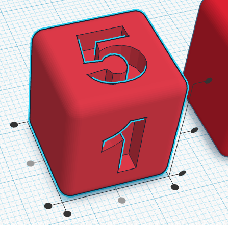
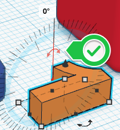
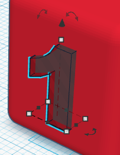

# Design Tips Handout

### TinkerCad Quick Tips:

## Move around the build plate: 
- Zoom: Use your mouse scroll wheel (or two-finger scroll on some trackpads)
- Rotate view: click and drag with right mouse button (or two-finger click on some trackpads) 
- Pan across build plate: Press and hold the Shift key while dragging with the right mouse button (or two-finger click on some trackpads) 

## Align: 
- Select all objects you wish to align (you can do this by holding down the shift button while selecting each object).  Then click on the “Align” button in the toolbar.
- This will bring up round handles at various alignment points. Click on the desired handle.

## Lift an item up or down: 
- Click and drag the upward-pointing black arrow at the top of your object

## Rotate:
- Drag the rounded, double-ended arrows to rotate an object. 
- The changing degrees will display as you turn the object.
- If you keep your mouse inside the compass the object will rotate in 12.5-degree increments. If you move your mouse outside the compass it will rotate in 1-degree increments.

## Save File:
- Click on the “Export” button on the top right of the toolbar, and then select “.STL” and save the file to your hard drive. From there it can be sent for printing at the DSC!

## To Print:
- Go to [**https://oac.uvic.ca/dsc/how-to-3d-print/**](https://oac.uvic.ca/dsc/how-to-3d-print/){:target="_blank"}

[NEXT STEP: Earn a Workshop Badge](informal-credentials.html){: .btn .btn-blue }
