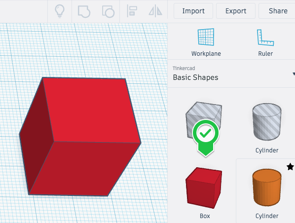
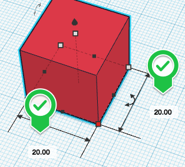
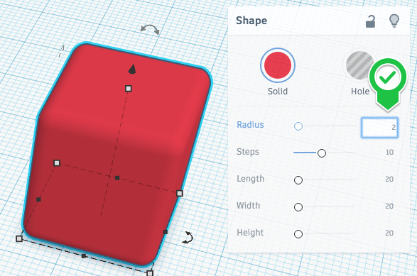
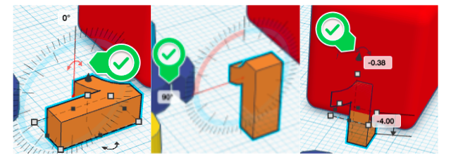
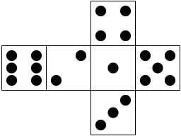
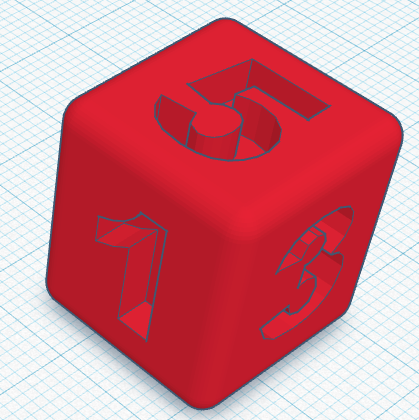

# Dice Activity

If you and your group have any questions or get stuck as you work through this in-class exercise, please ask the instructor for assistance.  Have fun!
1. If you haven’t already, please go to the [TinkerCad website and create an account](http://tinkercad.com){:target="_blank"} for yourself
2. Click “**Create new design**”.  If the TinkerCad tutorial pane is up on the right-hand side, you will need to get out of it before proceeding. Click on the **TinkerCad logo** at the top to bring you back to your main page. From there you should see the “**Create new design**” button. 
3. On the right side of the TinkerCad click on the “**Box**” and drag and drop it onto the workplane. 
4. Select the box and then click on the white “**handle**” on the bottom right of the box (it will then turn red). Click on a “**20.00**” and replace it with “**18**” and press enter. Change the other “**20.00**” to “**18**” as well, and press enter. Do the same with the top centre handle to adjust the height to 18. We’ve now resized the box to about the right size for a dice. 

5. Next, we will round the edges of the box by selecting the box, and then click on the “**0**” to the right of the “**Radius**” label, and change it to “**2**” and then press enter.

<button onclick="toggle('gif1')">Show/Hide Animation</button>
    

            

6.  Now that we have rounded edges, let’s put some numbers on this box and make it a die! On the right side of the TinkerCad open a drop-down menu by clicking on **Basic Shapes**, and then select the **Design Starters** option, then the **"A" Letter Icon**.  This will display a list of 3D letters that you can scroll down through to find the whole alphabet, plus numbers 1 through 9. Drag and drop numbers 1 through 6 onto the workplane.

7. Click on the number “**1**” and then grab hold of the top rounded arrow, and drag it to the left until the “**1**” is vertical, and the degrees displayed equals “**90**.”

<button onclick="toggle('gif2')">Show/Hide Animation</button>

 

 

8.  Drag the number “**1**” over to the middle of the closest face of the die until it is almost flat with its surface. Grab the pointy arrow above the “**1**” and drag it up until the “**1**” is centered on the face of the die. You can use Align to help get everything centered. Click the “**Hole**” button on the “**Shape**” tool panel. Group the number and die.'

<button onclick="toggle('gif2')">Show/Hide Animation</button>

 

9.  Do the same with each of the other numbers. If you want your die to look like a standard die, use the guide to the right. A good rule of thumb is that the opposite side of a die should add up to 7.  So because we put the “**1**” on the die first, the opposite side should have the “**6**” on it.
10. Once you have all the number is position around the die, it should look like this: 

11. Congratulations, you’ve made a die that’s ready to be exported and printed on a 3D printer!
12. Lastly, click on the “**Export**” button on the top right of the toolbar, and then select “**.STL**” and save the file to your hard drive so you can 3D print your custom die!
13. OPTIONAL: Feel free to stop here, but if you’re up for an interesting challenge, let’s make a loaded die that will be biased towards one of the six numbers on the die. Start by making a copy of your dice and then put an empty space behind one of the numbers, causing it to be lighter on one side and therefore more often land with that number up. Ask your instructor for pointers on how to do this.

[NEXT STEP: Heart-Shaped Box Activity](heart-box-activity.html){: .btn .btn-blue }
