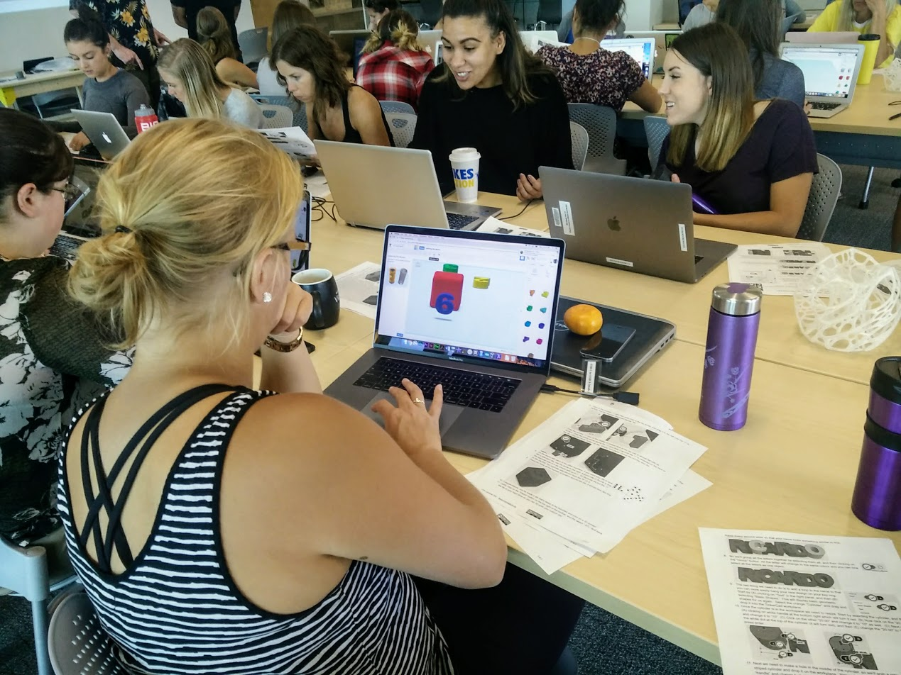

 

# Introduction to 3D Design and Print with TinkerCad

- Pre-workshop activities: 12 min 
- Introductory presentation: 10 min
- Hands-on activities: 70 min

## Why TinkerCad? 

[TinkerCad](http://tinkercad.com){:target="_blank"} is a user friendly surface that enables users to create 3 dimensional digital designs, which then can be 3D printed and made into physical objects. TinkerCad is useful for all ages and levels, as its features are user friendly, free to save and use. TinkerCad makes 3D designing more accessible and grants the ability to publish designs under a Creative Commons license. In addition to this workshop, throughout TinkerCad there are numerous tutorials that model a hands-on approach to learning this software. 

## Learning objectives

By the end of this workshop, participants will be able to:

1. Add shapes and text to the TinkerCad workplace.
2. Move around the workspace by: Turning, Zooming, Panning, Reset view, Move, and Undo.
3. Resize and rotate objects using object sliders.
4. Extrude from objects, or make holes in them.
5. Bevel or round object edges.
6. Group objects together into one object.
7. Use the ruler and align tools in their projects.
8. Duplicate objects, including repeating patterns.
9. Create dice, personalized keychain, game piece, or similar design by the end of the workshop.
10. Export 3D models to STL format for 3D printing.
11. Find previously designed models they are interested in on Thingiverse and Sketchfab.
12. Select appropriate settings for printing specific models (orientation, raft, supports, infill density, layer height).
13. Understand the procedures for printing on the DSC printers, including how to submit a print job and pay for it.

[NEXT STEP: Pre-Workshop Activities](pre-workshop.html){: .btn .btn-blue }
